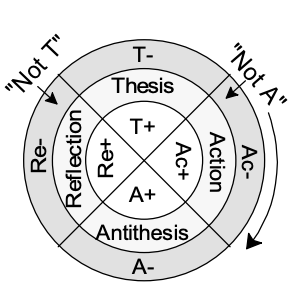

# Dialectical Framework
Turn stories, strategies, or systems into insight. Auto-generate Dialectical Wheels (DWs) from any text to reveal blind spots, surface polarities, and trace dynamic paths toward synthesis.
 DWs are semantic maps that expose tension, transformation, and coherence within a system—whether narrative, ethical, organizational, or technological.

## What It Does:
 - Converts natural language into Dialectical Wheels (DWs)
 - Highlights thesis–antithesis tensions and feedback loops
 - Reveals overlooked leverage points and systemic blind-spots
 - Maps decisions, ethics, or mindsets across dialectical structures

## Built for:
 - Systems optimization
 - Wisdom mining & decision diagnostics
 - Augmented intelligence / narrative AI
 - Ethical modeling & polarity navigation

## Useful for:
 - Consultants, coaches, facilitators, and system designers
 - Storytellers, educators, and regenerative thinkers
 - Strategists, SDD/BIMA practitioners, values-driven innovators

## Learn more:
 - [Dialectical Wheels Overview](https://dialexity.com/blog/dialectical-wheels-for-systems-optimization/)
 - [Wisdom Mining & Tokenomics](https://dialexity.com/blog/dialectical-token-dlt/)
 - [Dialectical Ethics](https://dialexity.com/blog/dialectical-ethics/)
 - [Earlier Work](https://dialexity.com/blog/wp-content/uploads/2023/11/Moral-Wisdom-from-Ontology-1.pdf)

# Development

## Contributors Welcome!

We invite developers, philosophers, cognitive scientists, and regenerative ecosystem builders to co-create with us.

## Setup

Behind the scenes we heavily rely on [Mirascope](https://mirascope.com/)

## Environment Variables

| Variable Name                    | Description                          | Example Value |
|----------------------------------|--------------------------------------|---------------|
| DIALEXITY_DEFAULT_MODEL          | Default model name for the framework | gpt-4         |
| DIALEXITY_DEFAULT_MODEL_PROVIDER | Model provider (required)            | openai        |

You can store these in a `.env` file or export them in your environment.

These will specify the default "brain" for your reasoning.

## Architecture

At the core of the dialectical framework is a dialectical wheel. It is a fancy semantic graph where nodes are statements or concepts and edges are relationships such as "opposite of," "complementary to," etc. To make the graph more readable, it's depicted as a 2D wheel.

The main architectural parts are:
- Wheel
- Wheel Segment
- Wisdom Unit
- Dialectical Component
- Transition

**Wheel** is composed of segments. Think of a dialectical wheel as a pizza, a segment is a slice of pizza. In the simplest case it represents some thesis (a statement, a concept, an action, a thought, an idea, etc.). A thesis can have positive and negative things related to it. Hence, a segment of a wheel is composed of these dialectical components: a thesis (T), positive side of that thesis (T+) and a negative side of that thesis (T-).

If we take two opposite segments, we get the basic (and the most important) structure: **Wisdom Unit**. So it's composed of:

| Dialectical Component | Description                      |
|-----------------------|----------------------------------|
| T-                    | Negative side of the main thesis |
| T                     | The thesis                       |
| T+                    | Positive side of the main thesis |
| A+                    | Positive side of the antithesis  |
| A                     | The antithesis                   |
| A-                    | Negative side of the antithesis  |

In a Wheel segments next to each other are related. We wrap that relationship into a **Transition**. Practically, a Transition is a recipe for how to go from one segment to another in a way that we approach synthesis. A recipe implies action (Ac), whereas on the other side each action has a reflection (Re). If we were to look at a wheel as a sliced pizza, the lines that separate the slices would be Transitions.